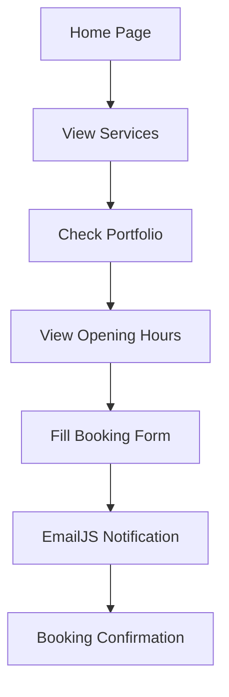

## 1. Product Overview
DS CUTZ is a minimal and clean barber website with dark/light mode toggle functionality. The website showcases barber services, portfolio work, and enables customers to book appointments via EmailJS integration.

The product solves the problem of modern barbers needing a professional online presence to display services, showcase work, and manage bookings efficiently. Target users are barbershop clients looking to book appointments and view services.

## 2. Core Features

### 2.1 User Roles
| Role | Registration Method | Core Permissions |
|------|---------------------|------------------|
| Visitor | No registration required | Browse services, view portfolio, read reviews, book appointments |

### 2.2 Feature Module
DS CUTZ requirements consist of the following main pages:
1. **Home page**: hero section, logo, navigation, services list, booking form, portfolio gallery, reviews section, opening hours.

### 2.3 Page Details
| Page Name | Module Name | Feature description |
|-----------|-------------|---------------------|
| Home page | Header | Display logo, navigation menu, dark/light mode toggle |
| Home page | Hero Section | Welcome message with barber branding |
| Home page | Services Section | List all services with prices and duration: Hair Cut 18+ (£20, 45m), Hair Cut 17 & under (£15, 45m), Shape Up (£10, 15m), Hot towel (£5, 5m), Beard Trim (£10, 15m) |
| Home page | Booking Form | Contact form with name, email, phone, service selection, preferred date/time, message input. Submit via EmailJS |
| Home page | Portfolio Gallery | Display client haircut photos from 'client pics/' folder in grid layout |
| Home page | Reviews Section | Show rating (5.0 stars), review count, and review comments area (initially empty) |
| Home page | Opening Hours | Display weekly schedule: Sat 12pm-8pm, Sun 2pm-8pm, Mon 3pm-8pm, Wed 2pm-8pm, Fri 4pm-8pm |
| Home page | Footer | Contact information and social links |

## 3. Core Process
Visitor Flow:
1. User lands on homepage and can toggle between dark/light modes
2. User browses services section to view available treatments and prices
3. User views portfolio gallery to see previous work quality
4. User checks opening hours to confirm availability
5. User fills booking form with personal details and service preferences
6. Form submission sends email to barber via EmailJS
7. User receives confirmation of booking request

## 4. User Interface Design

### 4.1 Design Style
- Primary colors: Black (#000000) for dark mode, White (#FFFFFF) for light mode
- Secondary colors: Light grey (#F5F5F5) for cards, Dark grey (#333333) for text
- Button style: Rounded corners with hover effects
- Font: Clean sans-serif (system fonts), 16px base size
- Layout style: Card-based sections with generous spacing
- Icons: Minimal line icons for navigation and features

### 4.2 Page Design Overview
| Page Name | Module Name | UI Elements |
|-----------|-------------|-------------|
| Home page | Header | Logo (logo.jpeg) left-aligned, hamburger menu right-aligned, mode toggle icon |
| Home page | Services Section | Card-based layout with service title, description, price/duration, thumbnail image |
| Home page | Booking Form | Clean form inputs with labels, submit button with loading state |
| Home page | Portfolio Gallery | Responsive grid layout (3 columns desktop, 2 tablet, 1 mobile) |
| Home page | Reviews Section | Star rating display, review count badge, comment cards |

### 4.3 Responsiveness
Desktop-first design approach with mobile responsiveness. Touch interaction optimization for mobile devices. Breakpoints at 768px (tablet) and 1024px (desktop).

### 4.4 3D Scene Guidance
Not applicable for this project.