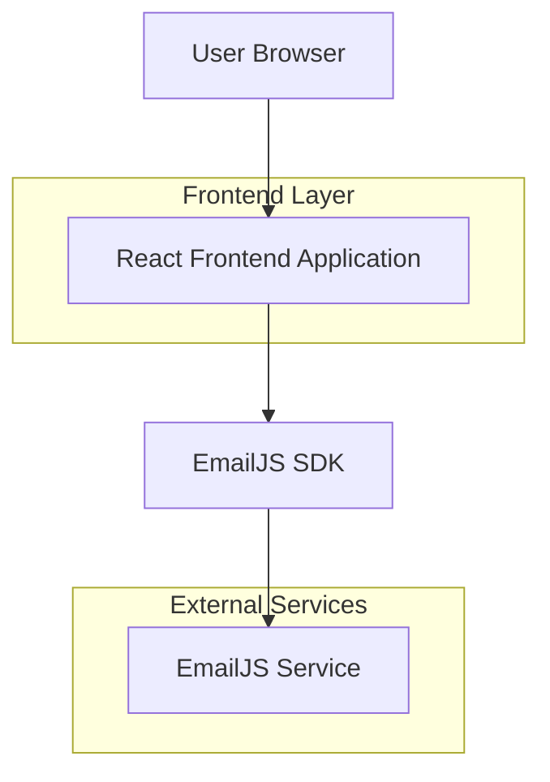

## 1.Architecture design



## 2.Technology Description
- Frontend: React@18 + tailwindcss@3 + vite
- Initialization Tool: vite-init
- Backend: None (EmailJS handles form submissions)
- External Services: EmailJS for booking notifications

## 3.Route definitions
| Route | Purpose |
|-------|---------|
| / | Home page, displays all sections and booking form |

## 4.API definitions
### 4.1 EmailJS Integration

Booking form submission
```
POST via EmailJS SDK
```

Request parameters:
| Param Name| Param Type  | isRequired  | Description |
|-----------|-------------|-------------|-------------|
| name  | string      | true        | Customer name |
| email  | string      | true        | Customer email address |
| phone  | string      | true        | Customer phone number |
| service  | string      | true        | Selected service from dropdown |
| date  | string      | true        | Preferred appointment date |
| time  | string      | true        | Preferred appointment time |
| message  | string      | false        | Additional message/notes |

Example
```javascript
{
  "name": "John Smith",
  "email": "john@example.com",
  "phone": "07123456789",
  "service": "Hair Cut 18+",
  "date": "2024-01-15",
  "time": "14:00",
  "message": "Skin fade please"
}
```

## 5.Server architecture diagram
Not applicable - client-side only application with EmailJS integration.

## 6.Data model
Not applicable - no database required. Static content and EmailJS form handling.